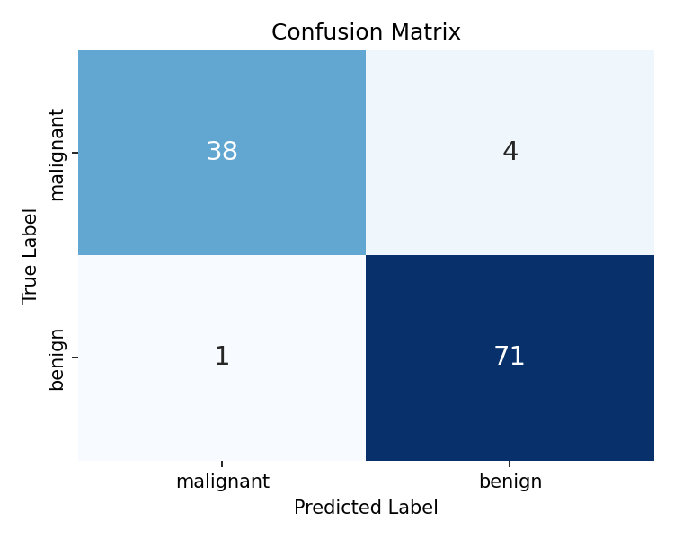
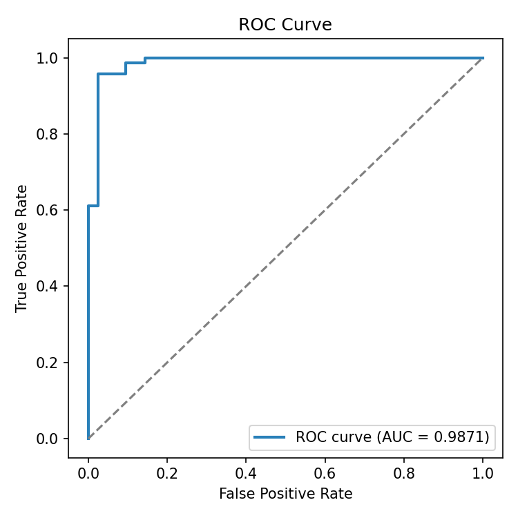

# Breast Cancer Detection using Logistic Regression, SHAP & LIME

A machine learning project that classifies breast tumors as **Benign** or **Malignant**
using the Scikit-learn Breast Cancer Wisconsin (Diagnostic) dataset, with model
predictions explained through **SHAP** and **LIME** for interpretability.

## Results

| Metric | Score |
|---|---|
| Accuracy | **95.61%** |
| Precision | 94.67% |
| Recall | 98.61% |
| F1-Score | 96.60% |
| ROC-AUC | 98.71% |




## Project Structure

```
breast_cancer_project/
├── notebooks/
│   └── breast_cancer_detection.ipynb   # Main notebook — run this end-to-end
├── src/
│   ├── data_preprocessing.py           # Load data, train/test split, scaling
│   ├── eda.py                          # Class distribution & correlation plots
│   ├── train_model.py                  # Logistic Regression training
│   ├── evaluate_model.py               # Metrics, confusion matrix, ROC curve
│   ├── explainability.py               # SHAP + LIME explanations
│   └── main.py                         # Runs the full pipeline end-to-end
├── outputs/
│   ├── figures/                        # All generated plots (PNG)
│   └── metrics.json                    # Saved evaluation metrics
├── models/
│   ├── logistic_regression_model.pkl   # Trained model
│   └── scaler.pkl                      # Fitted StandardScaler
├── requirements.txt
└── README.md
```

## How to Run

### Option A — Notebook (recommended for Kaggle / portfolio)
1. Upload `notebooks/breast_cancer_detection.ipynb` to [Kaggle](https://www.kaggle.com/code) (SHAP & LIME are pre-installed there) or open locally in Jupyter.
2. Run all cells top to bottom.

### Option B — Scripts (locally)
```bash
pip install -r requirements.txt
cd src
python main.py
```
This runs the full pipeline: load data → EDA → preprocess → train → evaluate → SHAP → LIME,
saving every figure to `outputs/figures/` and the trained model to `models/`.

## Approach

1. **Data**: 569 samples, 30 numeric features derived from digitized images of a fine
   needle aspirate (FNA) of a breast mass (radius, texture, perimeter, area, smoothness,
   concavity, symmetry, etc.). Target is binary: malignant (0) or benign (1).
2. **Preprocessing**: Stratified 80/20 train-test split, followed by `StandardScaler`
   feature scaling (fit on train only, to avoid data leakage) — important for Logistic
   Regression, which is sensitive to feature scale.
3. **Model**: `LogisticRegression` from Scikit-learn (`max_iter=5000`). Chosen for its
   strong baseline performance on this dataset and, crucially, its interpretability —
   coefficients directly indicate how each feature pushes the prediction.
4. **Evaluation**: Accuracy, Precision, Recall, F1-score, Confusion Matrix, and ROC-AUC —
   Recall is emphasized in the write-up since false negatives (missing a malignant tumor)
   are the costlier error in a medical screening context.
5. **Explainability**:
   - **SHAP** (`LinearExplainer`, exact for linear models) — a global beeswarm/bar plot
     showing which features drive predictions across the whole test set, plus a local
     waterfall plot explaining one individual prediction.
   - **LIME** — perturbs a single instance and fits a local surrogate model to explain
     that one prediction in human-readable terms; useful to sanity-check SHAP's findings
     from a different methodology.

## Key Findings

Features related to the **worst** (largest) measurements of cell nuclei — particularly
`worst concave points`, `worst perimeter`, `worst radius`, and `mean concave points` —
were the strongest predictors of malignancy. This aligns with the clinical intuition that
larger, more irregularly-shaped (concave) nuclei are associated with malignant tumors.

## Tech Stack

Python · Scikit-learn · SHAP · LIME · Matplotlib · Seaborn · Pandas · NumPy

## Bullet Points

- Developed a Logistic Regression model to classify breast tumors as Benign or Malignant
  using the Scikit-learn Breast Cancer dataset.
- Performed data preprocessing, stratified train-test split, and feature scaling/analysis
  before model training.
- Achieved 95.61% classification accuracy (F1-score: 96.6%, ROC-AUC: 98.7%), evaluated
  using Accuracy, Precision, Recall, F1-Score, and Confusion Matrix.
- Implemented SHAP and LIME to explain model predictions and visualize the most
  influential features, improving model interpretability for a clinical use case.

## Possible Extensions

- Compare against Random Forest, SVM, and XGBoost classifiers.
- Add cross-validation and hyperparameter tuning (`GridSearchCV`).
- Deploy as an interactive Streamlit app with live SHAP explanations per patient.
